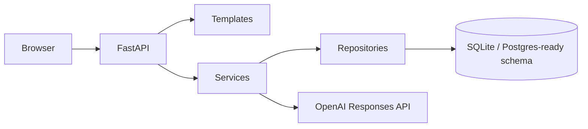
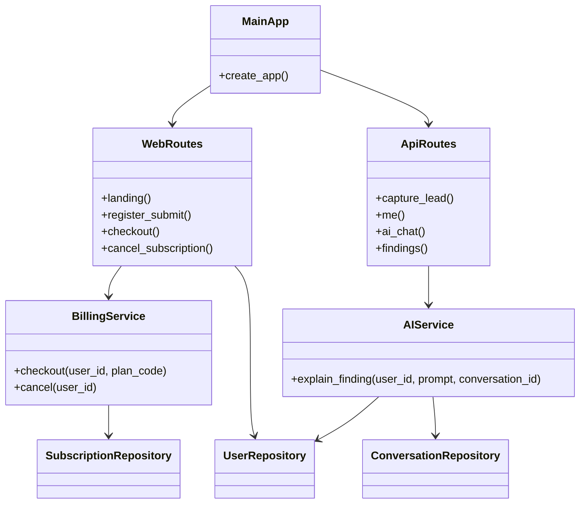
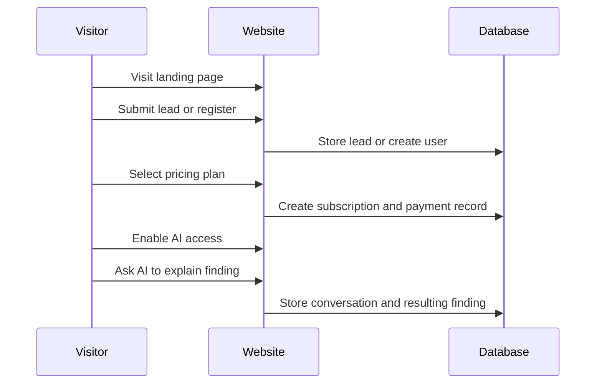

# UML and architecture notes

## Component diagram

```mermaid
flowchart LR
    Browser --> FastAPI
    FastAPI --> Templates
    FastAPI --> Services
    Services --> Repositories
    Repositories --> SQLite[(SQLite / Postgres-ready schema)]
    Services --> OpenAI[OpenAI Responses API]
```

## Module relationship

```mermaid
classDiagram
    class MainApp {
      +create_app()
    }
    class WebRoutes {
      +landing()
      +register_submit()
      +checkout()
      +cancel_subscription()
    }
    class ApiRoutes {
      +capture_lead()
      +me()
      +ai_chat()
      +findings()
    }
    class BillingService {
      +checkout(user_id, plan_code)
      +cancel(user_id)
    }
    class AIService {
      +explain_finding(user_id, prompt, conversation_id)
    }
    class UserRepository
    class SubscriptionRepository
    class ConversationRepository

    MainApp --> WebRoutes
    MainApp --> ApiRoutes
    WebRoutes --> BillingService
    WebRoutes --> UserRepository
    ApiRoutes --> AIService
    BillingService --> SubscriptionRepository
    AIService --> ConversationRepository
    AIService --> UserRepository
```

## Primary user path

```mermaid
sequenceDiagram
    participant V as Visitor
    participant W as Website
    participant D as Database

    V->>W: Visit landing page
    V->>W: Submit lead or register
    W->>D: Store lead or create user
    V->>W: Select pricing plan
    W->>D: Create subscription and payment record
    V->>W: Enable AI access
    V->>W: Ask AI to explain finding
    W->>D: Store conversation and resulting finding
```
